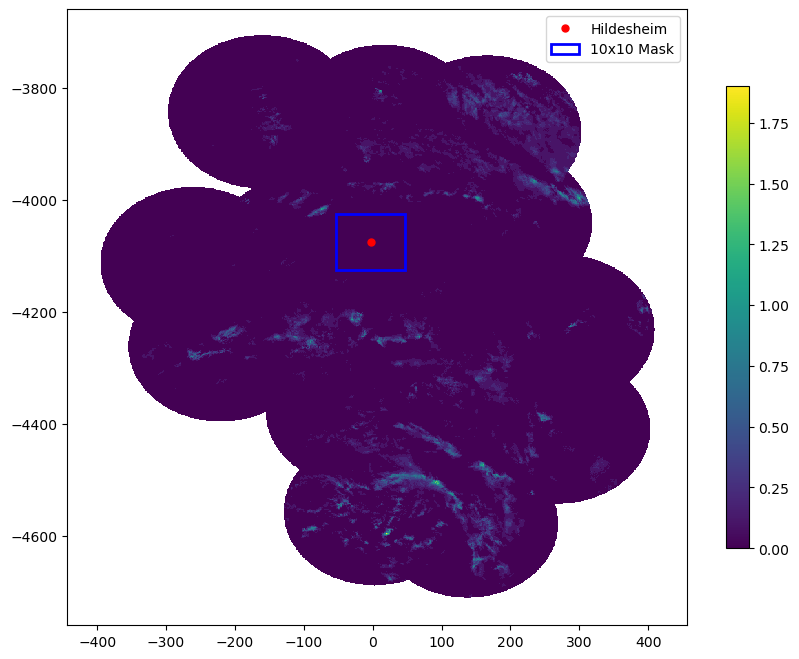

# trinkxtrem_extention

This is the repository for the extention of TrinkXtrem project.

## Instalation
To install and setup:
1. Clone the repository:
```bash
git clone git@gitlab.tu-clausthal.de:ma64/trinkxtrem_extention.git
cd trinkxtrem_extension
```
2. create a new virtual environment and install the dependencies:
```bash
conda create --name <env_name> --file requirements.txt
conda activate <env_name>
```
## Usage
Using the `pp` class, the Radolan image data can be acquired by instantiating an target location object. To do so, The coordination of desired city should be given as a numpy.ndarray anlong with the radolan data resolution. Here is an example:
```python
from utils import pp

latlon_hildesheim = np.array([9.9580, 52.1548])
h = pp(1100, 900, latlon_hildesheim, 50, "Hildesheim")
``` 
by using `mask_region()` method, the indices for the target location can be achieved. Finally, you can use the method `plot_mask()` to get the visualization for the appropraite inpute `data`.
```python
mask_idx = h.mask_region()
h.plot_mask(data)
```
